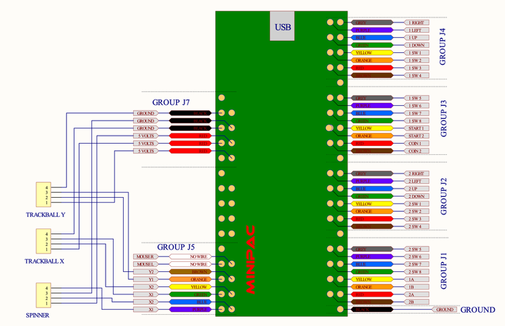

# UltimarcMiniPacConfig
**Currently installed in X Gaming Controller**

## IPAC Mapping Change Log

| Date            | Notes                                                        |
| --------------- | ------------------------------------------------------------ |
| 3/8/26          | Copied over Rec Room Masters version and then updated based on physical mapping of XGaming Controller. |
| 3/8/26 12:01 PM | Imported latest Rec Room Masters Keyboard config.  Left as is and will commit. |
| 3/8/26 12:13    | Made updates to keyboard per the [Retropie GitHub Keyboard Controllers Settings](https://github.com/RetroPie/RetroPie-Docs/blob/master/docs/Keyboard-Controllers.md) |

| IPAC Group | IPAC Wire Color | IPAC Code | IPAC Pin Row | IPAC Pin Location | Physical Controller Mapping | Keyboard Mapping | IPAC Assignment     | Comment                                                      |
| ---------- | --------------- | --------- | ------------ | ----------------- | --------------------------- | ---------------- | ------------------- | ------------------------------------------------------------ |
| J4         | Grey            | 1 RIGHT   | 1            | Outside           | P1 Right                    | Right Arrow      | P1 Dpad-R           |                                                              |
| J4         | Purple          | 1 LEFT    | 1            | Inside            | P1 Left                     | Left Arrow       | P1 Dpad-L           |                                                              |
| J4         | Blue            | 1 UP      | 2            |                   | P1 Up                       | Up Arrow         | P1 Dpad-U           |                                                              |
| J4         | Green           | 1 DOWN    | 2            |                   | P1 Down                     | Down Arrow       | P1 Dpad-D           |                                                              |
| J4         | Yellow          | 1 SW 1    | 3            |                   | P1 B1 (Top Left)            | L-CTRL           | P1 Button 1 (A)     |                                                              |
| J4         | Orange          | 1 SW 2    | 3            |                   | P1 B2 (Top Mid)             | L-ALT            | P1 Button 2 (B)     |                                                              |
| J4         | Red             | 1 SW 3    | 4            |                   | P1 B3 (Top Right)           | Space            | P1 Button 3 (X)     |                                                              |
| J4         | Brown           | 1 SW 4    | 4            |                   | P1 B4 (Bottom Left)         | L-SHIFT          | P1 Button 4 (Y)     |                                                              |
| Empty      |                 |           | 5            |                   |                             |                  |                     |                                                              |
| J3         | Grey            | 1 SW 5    | 6            |                   | P1 B5 (Bottom Mid)          | Z                | P1 Button 5 (LR)    |                                                              |
| J3         | Purple          | 1 SW 6    | 6            |                   | P1 B6 (Bottom Right)        | X                | P1 Button 6 (RR)    |                                                              |
| J3         | Blue            | 1 SW 7    | 7            |                   | P1 B7 - Bottom Bottom L     | **C**            | P1 Ltrig            | Mapped according to this GitHub page I found. (Link in Notes above) |
| J3         | Green           | 1 SW 8    | 7            |                   | P1 B8 - Bottom Bottom R     | **V**            | P1 Rtrig            | Mapped according to this GitHub page I found. (Link in Notes above) |
| J3         | Yellow          | Start 1   | 8            |                   | P1 Start                    | 1                | P1 Button 8 (Start) |                                                              |
| J3         | Orange          | Start 2   | 8            |                   | P2 Start                    | 2                | P2 Button 8 (Start) |                                                              |
| J3         | Red             | Coin 1    | 9            |                   | Pinball Left                | 5                | P1 Home             |                                                              |
| J3         | Brown           | Coin 2    | 9            |                   | Pinball Right               | 6                | P2 Home             |                                                              |
| Empty      |                 |           | 10           |                   |                             |                  |                     |                                                              |
| J2         | Grey            | 2 RIGHT   | 1            | Outside           | P2 Right                    | G                | P2 Dpad-R           |                                                              |
| J2         | Purple          | 2 LEFT    | 1            | Inside            | P2 Left                     | D                | P2 Dpad-L           |                                                              |
| J2         | Blue            | 2 UP      | 2            |                   | P2 Up                       | R                | P2 Dpad-U           |                                                              |
| J2         | Green           | 2 DOWN    | 2            |                   | P2 Down                     | F                | P2 Dpad-D           |                                                              |
| J2         | Yellow          | 2 SW 1    | 3            |                   | P2 B1 (Top Left)            | A                | P2 Button 1 (A)     |                                                              |
| J2         | Orange          | 2 SW 2    | 3            |                   | P2 B2 (Top Mid)             | S                | P2 Button 2 (B)     |                                                              |
| J2         | Red             | 2 SW 3    | 4            |                   | P2 B3 (Top Right)           | Q                | P2 Button 3 (X)     |                                                              |
| J2         | Brown           | 2 SW 4    | 4            |                   | P2 B4 (Bottom Left)         | W                | P2 Button 4 (Y)     |                                                              |
| Empty      |                 |           |              |                   |                             |                  |                     |                                                              |
| J1         | Grey            | 2 SW 5    | 5            |                   | P2 B5 (Bottom Mid)          | I                | P2 Button 5 (LR)    |                                                              |
| J1         | Purple          | 2 SW 6    | 5            |                   | P2 B6 (Bottom Right)        | K                | P2 Button 6 (RR)    |                                                              |
| J1         | Blue            | 2 SW 7    | 6            |                   | P2 B7 - Bottom Bottom L     | **J**            | P2 Ltrig            | Mapped according to this GitHub page I found. (Link in Notes above) |
| J1         | Green           | 2 SW 8    | 6            |                   | P2 B8 - Bottom Bottom R     | **L**            | P2 Rtrig            | Mapped according to this GitHub page I found. (Link in Notes above) |
| J1         | Yellow          | 1A        | 7            |                   | Back Button                 | P                | P1 Button 7 (Back)  |                                                              |
| J1         | Orange          | 1B        | 7            |                   | Not connected               | Enter            | P1 Home             |                                                              |
| J1         | Red             | 2A        | 8            |                   | Not connected               | Tab              | P2 Button 10        |                                                              |
| J1         | Brown           | 2B        | 8            |                   | Not connected               | Esc              | P2 Button 9         |                                                              |
| Ground     | Black           | GROUND    |              |                   | Ground                      |                  | Ground              |                                                              |

## Physical Diagram

